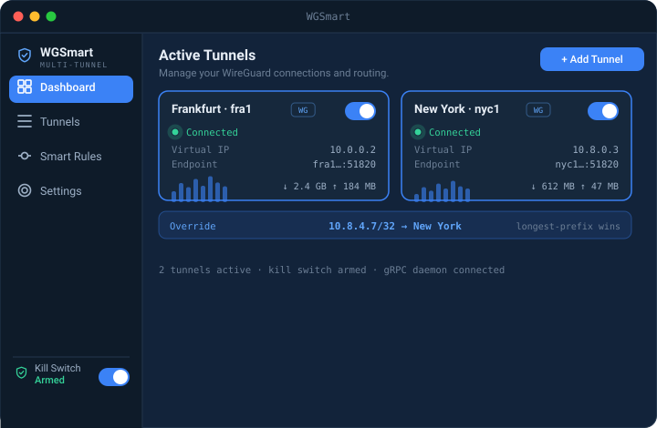
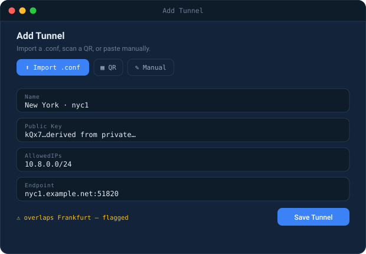
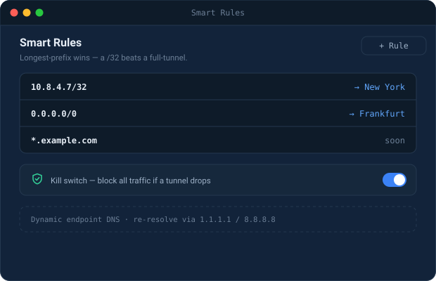
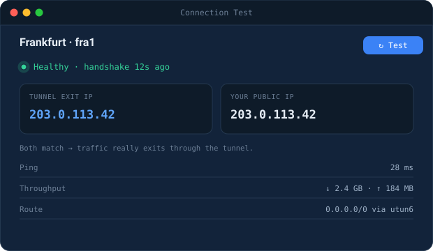
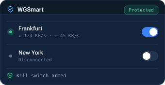

<!-- ============================================================= -->
<!--  WGSmart — public landing README  (English · Tiếng Việt · 中文) -->
<!--  Source code lives elsewhere. This repo = intro + releases.    -->
<!-- ============================================================= -->

<div align="center">


# WGSmart

**The WireGuard power-tool for macOS.**
Run and route **multiple WireGuard tunnels at once** — with per-IP control the official client can't give you.

<sub>Securing the intelligence edge.</sub>

<br/>

[](#-download--install)
[](https://github.com/lyquyduong/WGSmart/releases)
[](#-license)
[](https://github.com/lyquyduong/WGSmart)
<!-- Pre-launch, this is a call-to-action (no count) so it never shows "0 stars".
     Once the repo has traction, swap it for the live count:
     [](https://github.com/lyquyduong/WGSmart/stargazers) -->
<!-- After the first GitHub release, replace the static Status badge above with these live ones:
[](https://github.com/lyquyduong/WGSmart/releases/latest)
[](https://github.com/lyquyduong/WGSmart/releases)
-->


<br/>

**🌐 &nbsp;[English](#en) &nbsp;·&nbsp; [Tiếng Việt](#vi) &nbsp;·&nbsp; [中文](#zh)**

<br/>

[**⬇️ Download**](#-download--install) &nbsp;·&nbsp; [**✨ Working now**](#-working-now) &nbsp;·&nbsp; [**🗺️ Roadmap**](#-roadmap)

<br/>

<!-- Landing hero image. To swap for a real screenshot, see assets/screenshots/MANIFEST.md -->


</div>

---

<a id="en"></a>

## 🇬🇧 English

### What is WGSmart?

WGSmart is a **WireGuard control-plane for power users** on macOS. The official WireGuard client keeps **one** tunnel up at a time. WGSmart keeps **several** up simultaneously and lets you decide — down to a single IP or subnet — **which traffic goes through which tunnel**.

It was born from a real need: two VPNs on two servers, both required at the same time. Route range A through VPN A and range B through VPN B — at once — or pin one specific IP to the exact tunnel you choose. That's the job the stock client won't do.

> **You bring your own WireGuard configs.** WGSmart is not a VPN service — it's the manager that makes your tunnels behave.

### ✨ Working now

Used every day on macOS by the person who wrote it.

- 🔀 **Many tunnels, all at once** — Each keeps its own `AllowedIPs`, connected in parallel rather than one-at-a-time.
- 🎯 **Route any address to any tunnel** — Pin an IP or CIDR to a specific tunnel. Longest prefix wins, so a `/32` overrides a full tunnel.
- 🛡️ **Kill switch that fails closed** — Built on `pf`. It snapshots your existing firewall rules and restores them on the way out, instead of trampling them.
- ⚠️ **Conflicts caught at import** — Overlapping ranges and a second full-tunnel config get flagged before they break your routing.
- 🧪 **Prove it is actually routing** — One click reports handshake age, round-trip, and the tunnel's exit IP next to your real public IP. A second check verifies every route against the kernel.
- 🌐 **Endpoints that move** — Hostname endpoints are re-resolved via `1.1.1.1` / `8.8.8.8` when they change, so a server on a dynamic address does not strand the tunnel.
- 📜 **Live logs, per tunnel and system-wide** — Streamed straight from the engine, filterable, exportable.
- 🎛️ **Menu bar and dashboard** — Throughput and handshake age at a glance; the full window when you need to change something.
- ⌨️ **A real CLI** — Every action in the app is also one command, over the same interface. Scriptable, JSON output.
- 🏗️ **Config Studio** — Author a server profile and its client configs, generate keys on-device, hand them out as files or QR codes.
- 🔐 **Keys stay in the Keychain** — Private keys live in the macOS Keychain, never in plaintext on disk.
- ✍️ **Updates you can verify** — Every release carries a SHA-256 and an Ed25519 signature, checked by the app and then independently again by the privileged service before anything installs. The signature binds the filename, so a downgrade fails closed, and the signing key has never been on GitHub.

### 🧪 Built, still being proven

Written, tested in isolation, and shipping in the build — but not yet run long enough on real machines to promise they work. Listed here rather than sold to you.

- 🌍 **Route by domain** — Resolves a domain and pins the addresses it returns. Best-effort by nature: apps using DoH/DoT or hard-coded IPs slip past it, and large CDNs return pools that shift. A routing convenience, **not a security control**.
- 👤 **Route by macOS user** — On macOS this matches the **user a process runs as, not the individual app**. Genuine per-application routing needs an Apple entitlement WGSmart does not have.
- 🔌 **Route by port** — Send a port or range down a chosen tunnel, TCP, UDP or both, matching on source or destination.
- 🧭 **DNS routing** — A local resolver that watches answers to pin routes more accurately. Present but **switched off by default**, because a resolver that misbehaves takes the whole machine's DNS with it.
- 📊 **Notification Center widget** — Tunnel status at a glance. **Read-only** — it shows state, it does not toggle tunnels.
- 📶 **Smart rules by Wi-Fi** — Auto-connect on untrusted networks, stand down on trusted SSIDs.
- 🖥️ **Linux and Windows** — The engine cross-compiles and its tests pass for both, and a headless Linux service with a browser UI exists. Neither has been run against a real kernel, so neither is offered as a download.

### 🖼️ Screenshots

| Add a tunnel | Smart Rules | Connection test |
|---|---|---|
|  |  |  |

<p align="center"></p>

### ⬇️ Download & Install

1. Grab the latest **`WGSmart-<version>.pkg`** from the [**Releases**](https://github.com/lyquyduong/WGSmart/releases) page.
2. Double-click the `.pkg`. It installs **WGSmart.app** to `/Applications` plus the background service the tunnels need — WireGuard on macOS cannot create tunnels or set routes without one.
3. Launch **WGSmart**, import your `.conf` files, and connect.

> **Requirements:** **macOS 15 or later** · Apple Silicon and Intel · administrator access, for the routing and kill-switch service.

#### macOS will warn you the first time. Here is exactly why.

WGSmart is **not yet notarized by Apple**. Notarization needs a paid Apple Developer membership this project does not have yet, so on first launch macOS says the developer cannot be verified. **That warning is accurate** — Apple has not checked this build.

To open it anyway: right-click the app ▸ **Open**, then confirm once. You should not need to repeat it for later updates.

If that is not a trade you want to make for a tool that runs with system privileges, that is a completely reasonable call — wait for the notarized build. It is the next thing being funded, and the goal is in the Support section below.

#### Verify what you downloaded

```sh
shasum -a 256 WGSmart-<version>.pkg
```

Compare the result against the checksum published with the release. The in-app updater goes further: it checks the SHA-256 **and** an Ed25519 signature, and the privileged service re-checks both itself before installing anything. The signature binds the filename, so an older build cannot be replayed as a newer one — and the signing key has never been on GitHub, so a compromised account still cannot forge an update WGSmart will accept.

### 🗺️ Roadmap

**macOS first** (now) → **Linux server edition** with a remote browser UI (written, never run on a real Linux host) → **Windows** (the engine compiles for it; routing by user and by port have no equivalent mechanism there yet, and the app fails those calls honestly rather than pretending).

**Apple notarization is next.** It removes the first-launch warning entirely, and it is funded by donations — the goal is below. A desktop Tauri shell was considered and **dropped**: the Linux service's browser UI already covers that need. **iOS is intentionally parked** — Apple's networking framework allows one active tunnel at a time, which removes the entire reason WGSmart exists. **Not on the Mac App Store** either: the privileged service and firewall access WGSmart depends on are not permitted inside the App Store sandbox.

Model: a free, closed-source **Community Edition** + **Premium** + **Sponsor**. Releases are signed so you can verify them yourself.

### 💛 Support this project

**WGSmart is free — and staying that way.** If it saved you from juggling VPNs by hand, a small tip keeps it alive for everyone. No pressure. 🧡

> **First goal — the Apple Developer membership ($99/year).** It is the one thing standing between WGSmart and an install with no scary warning. Donations go to it first.

[**♥ Support**](https://ko-fi.com/nkcoder) &nbsp;·&nbsp; [**💡 Request a feature**](https://github.com/lyquyduong/WGSmart/issues) &nbsp;·&nbsp; [**🐛 Report a bug**](https://github.com/lyquyduong/WGSmart/issues) &nbsp;·&nbsp; [**⭐ Star the repo**](https://github.com/lyquyduong/WGSmart)

<!-- Before publishing, add the two QR images: assets/support/bank-vietqr.png and assets/support/momo-qr.png (kofi-qr.png is already in place). -->

| ☕ Ko-fi | 🏦 Bank transfer · VietQR | 📱 MoMo |
|:--:|:--:|:--:|
|  |  |  |
| [ko-fi.com/nkcoder](https://ko-fi.com/nkcoder)<br><sub>Buy me a coffee · international</sub> | **LÝ QUÝ DƯƠNG**<br><code>9007041118966</code><br><sub>Timo · BVBank · napas 247</sub> | **LÝ QUÝ DƯƠNG**<br><sub>account&nbsp;·&nbsp;\*\*\*\*\*\*\*045</sub> |

---

<a id="vi"></a>

## 🇻🇳 Tiếng Việt

### WGSmart là gì?

WGSmart là **control-plane WireGuard cho power user** trên macOS. Client WireGuard chính chủ chỉ bật được **một** tunnel tại một thời điểm. WGSmart bật **nhiều** tunnel **cùng lúc** và cho bạn quyết định — tới từng IP hoặc subnet — **traffic nào đi qua tunnel nào**.

Nó sinh ra từ nhu cầu thật: hai VPN trên hai server, cần dùng đồng thời. Cho dải A đi qua VPN A và dải B đi qua VPN B — cùng lúc — hoặc ghim một IP cụ thể vào đúng tunnel bạn chọn. Đó là việc client mặc định không làm được.

> **Bạn tự mang config WireGuard của mình.** WGSmart không phải dịch vụ VPN — nó là trình quản lý giúp các tunnel của bạn chạy đúng ý.

### ✨ Đang chạy tốt

Chính người viết dùng mỗi ngày trên macOS.

- 🔀 **Nhiều tunnel, cùng lúc** — Mỗi cái giữ `AllowedIPs` riêng, kết nối song song thay vì lần lượt.
- 🎯 **Đẩy địa chỉ nào qua tunnel nào cũng được** — Ghim một IP hoặc CIDR vào tunnel cụ thể. Prefix dài hơn thắng, nên `/32` ghi đè cả full tunnel.
- 🛡️ **Kill switch fail-closed** — Dựng trên `pf`. Nó chụp lại ruleset firewall đang có của bạn và phục hồi khi tắt, chứ không đạp lên.
- ⚠️ **Bắt xung đột ngay khi import** — Dải IP trùng nhau và config full-tunnel thứ hai được cảnh báo trước khi làm hỏng routing.
- 🧪 **Chứng minh nó đang route thật** — Một click báo tuổi handshake, round-trip, và IP thoát của tunnel đặt cạnh IP công khai thật. Một kiểm tra nữa đối chiếu từng route với kernel.
- 🌐 **Endpoint hay đổi IP** — Endpoint dạng hostname được resolve lại qua `1.1.1.1` / `8.8.8.8` khi thay đổi, nên server dùng IP động không làm tunnel chết.
- 📜 **Log trực tiếp, theo tunnel và toàn hệ thống** — Stream thẳng từ engine, lọc được, export được.
- 🎛️ **Menu bar và dashboard** — Throughput và tuổi handshake nhìn là biết; mở cửa sổ đầy đủ khi cần sửa.
- ⌨️ **CLI thật** — Mọi thao tác trong app đều có một câu lệnh tương ứng, qua cùng một interface. Script được, xuất JSON.
- 🏗️ **Config Studio** — Soạn profile server và config client, sinh khoá ngay trên máy, phát ra dạng file hoặc QR.
- 🔐 **Khoá nằm trong Keychain** — Private key ở Keychain macOS, không bao giờ để plaintext trên đĩa.
- ✍️ **Bản cập nhật kiểm chứng được** — Mỗi bản có SHA-256 và chữ ký Ed25519, app kiểm rồi service quyền cao kiểm độc lập lần nữa trước khi cài. Chữ ký bind cả tên file nên hạ cấp phiên bản là fail closed, và khoá ký chưa bao giờ nằm trên GitHub.

### 🧪 Đã viết, còn đang kiểm chứng

Đã viết xong, test riêng lẻ đạt, và có trong bản build — nhưng chưa chạy đủ lâu trên máy thật để dám hứa là ổn. Nên liệt kê ở đây, không phải để bán cho bạn.

- 🌍 **Route theo domain** — Resolve domain rồi ghim các địa chỉ nhận được. Bản chất là best-effort: app dùng DoH/DoT hoặc IP hard-code sẽ lọt qua, và CDN lớn trả về pool luôn thay đổi. Đây là tiện ích routing, **không phải biện pháp bảo mật**.
- 👤 **Route theo user macOS** — Trên macOS cái này khớp theo **user mà process chạy dưới, không phải từng app riêng**. Route theo app thật sự cần một entitlement của Apple mà WGSmart không có.
- 🔌 **Route theo cổng** — Đẩy một cổng hoặc dải cổng qua tunnel chọn trước, TCP, UDP hoặc cả hai, khớp theo cổng nguồn hoặc đích.
- 🧭 **Route theo DNS** — Một resolver cục bộ quan sát câu trả lời để ghim route chính xác hơn. Có sẵn nhưng **mặc định tắt**, vì resolver chạy sai sẽ kéo theo DNS của cả máy.
- 📊 **Widget Notification Center** — Trạng thái tunnel nhìn là biết. **Chỉ đọc** — nó hiện trạng thái, không bật tắt tunnel.
- 📶 **Smart rules theo Wi-Fi** — Tự kết nối ở mạng không tin cậy, tự đứng xuống ở SSID tin cậy.
- 🖥️ **Linux và Windows** — Engine cross-compile được và test đạt cho cả hai, và đã có service Linux headless kèm UI trên browser. Cả hai chưa chạy với kernel thật, nên chưa cái nào được đưa ra tải.

### 🖼️ Ảnh chụp

| Thêm tunnel | Smart Rules | Test kết nối |
|---|---|---|
|  |  |  |

<p align="center"></p>

### ⬇️ Tải & Cài đặt

1. Lấy bản **`WGSmart-<version>.pkg`** mới nhất ở trang [**Releases**](https://github.com/lyquyduong/WGSmart/releases).
2. Double-click file `.pkg`. Nó cài **WGSmart.app** vào `/Applications` kèm service chạy nền mà tunnel cần — WireGuard trên macOS không tạo được tunnel hay set route nếu thiếu.
3. Mở **WGSmart**, import các file `.conf`, rồi kết nối.

> **Yêu cầu:** **macOS 15 trở lên** · Apple Silicon và Intel · quyền administrator, cho service routing và kill switch.

#### macOS sẽ cảnh báo ở lần đầu. Đây là lý do chính xác.

WGSmart **chưa được Apple notarize**. Notarize cần tài khoản Apple Developer trả phí mà dự án chưa có, nên lần mở đầu macOS nói không xác minh được nhà phát triển. **Cảnh báo đó là đúng** — Apple chưa kiểm tra bản build này.

Để vẫn mở: bấm chuột phải vào app ▸ **Open**, rồi xác nhận một lần. Các bản cập nhật sau sẽ không cần làm lại.

Nếu bạn thấy đó không phải đánh đổi đáng làm cho một công cụ chạy với quyền hệ thống, thì đó là quyết định hoàn toàn hợp lý — hãy chờ bản đã notarize. Đó là mục được ưu tiên gây quỹ, mục tiêu nằm ở phần Ủng hộ bên dưới.

#### Kiểm tra file bạn vừa tải

```sh
shasum -a 256 WGSmart-<version>.pkg
```

So kết quả với checksum công bố kèm bản phát hành. Bộ cập nhật trong app còn đi xa hơn: nó kiểm SHA-256 **và** chữ ký Ed25519, rồi service quyền cao tự kiểm lại cả hai trước khi cài. Chữ ký bind cả tên file nên không thể phát lại bản cũ như bản mới — và khoá ký chưa bao giờ nằm trên GitHub, nên tài khoản bị chiếm vẫn không tạo được bản cập nhật mà WGSmart chấp nhận.

### 🗺️ Roadmap

**macOS trước** (hiện tại) → **bản server Linux** kèm UI trên browser từ xa (đã viết, chưa từng chạy trên host Linux thật) → **Windows** (engine compile được; route theo user và theo cổng chưa có cơ chế tương đương ở đó, và app báo lỗi trung thực chứ không giả vờ làm được).

**Apple notarization là việc kế tiếp.** Nó bỏ hẳn cảnh báo lần đầu, và được gây quỹ từ tiền ủng hộ — mục tiêu ở ngay dưới. Vỏ desktop Tauri đã được cân nhắc và **bỏ**: UI trên browser của service Linux đã đủ cho nhu cầu đó. **iOS chủ động gác lại** — framework mạng của Apple chỉ cho một tunnel hoạt động tại một thời điểm, tức là mất luôn lý do tồn tại của WGSmart. **Cũng không lên Mac App Store**: service quyền cao và quyền truy cập firewall mà WGSmart cần đều không được phép trong sandbox App Store.

Mô hình: **Community Edition** miễn phí, mã nguồn đóng + **Premium** + **Sponsor**. Bản phát hành được ký để bạn tự kiểm chứng.

### 💛 Ủng hộ dự án

**WGSmart miễn phí — và sẽ luôn như vậy.** Nếu nó giúp bạn khỏi phải chuyển VPN bằng tay, một khoản nhỏ giúp dự án sống tiếp cho mọi người. Không áp lực nhé. 🧡

> **Mục tiêu đầu tiên — tài khoản Apple Developer ($99/năm).** Đây là thứ duy nhất còn chắn giữa WGSmart và một lần cài không có cảnh báo đáng sợ. Tiền ủng hộ dùng cho nó trước.

[**♥ Ủng hộ**](https://ko-fi.com/nkcoder) &nbsp;·&nbsp; [**💡 Yêu cầu tính năng**](https://github.com/lyquyduong/WGSmart/issues) &nbsp;·&nbsp; [**🐛 Báo lỗi**](https://github.com/lyquyduong/WGSmart/issues) &nbsp;·&nbsp; [**⭐ Star repo**](https://github.com/lyquyduong/WGSmart)

| ☕ Ko-fi | 🏦 Chuyển khoản · VietQR | 📱 MoMo |
|:--:|:--:|:--:|
|  |  |  |
| [ko-fi.com/nkcoder](https://ko-fi.com/nkcoder)<br><sub>Mời một ly cà phê · quốc tế</sub> | **LÝ QUÝ DƯƠNG**<br><code>9007041118966</code><br><sub>Timo · BVBank · napas 247</sub> | **LÝ QUÝ DƯƠNG**<br><sub>tài khoản&nbsp;·&nbsp;\*\*\*\*\*\*\*045</sub> |

---

<a id="zh"></a>

## 🇨🇳 中文

### WGSmart 是什么？

WGSmart 是 macOS 上面向**高级用户的 WireGuard 控制台**。官方 WireGuard 客户端一次只能启用**一条**隧道；WGSmart 可以**同时**保持**多条**隧道在线，并让你精确到单个 IP 或子网地决定——**哪些流量走哪条隧道**。

它源于真实需求：两台服务器上的两个 VPN 需要同时使用。让 A 段走 VPN A、B 段走 VPN B——同时进行——或把某个具体 IP 固定到你指定的隧道。这正是官方客户端做不到的。

> **隧道配置由你自备。** WGSmart 不是 VPN 服务，而是让你的隧道按你意愿运行的管理器。

### ✨ 已经好用

作者本人每天在 macOS 上使用。

- 🔀 **多条隧道同时运行** — 各自保留自己的 `AllowedIPs`，并行连接，而不是轮流上线。
- 🎯 **任意地址走任意隧道** — 把某个 IP 或 CIDR 钉到指定隧道。更长的前缀优先，因此 `/32` 可以覆盖全局隧道。
- 🛡️ **故障即断网的开关** — 基于 `pf` 构建。它会先快照你现有的防火墙规则，退出时再还原，而不是直接覆盖。
- ⚠️ **导入时就发现冲突** — 重叠的地址段、第二份全局隧道配置，会在破坏路由之前被标出来。
- 🧪 **证明它真的在分流** — 一次点击就报告握手时间、往返延迟，以及隧道出口 IP 与你真实公网 IP 的对比。另一项检查会逐条对照内核验证路由。
- 🌐 **会变动的端点** — 域名端点在变化时通过 `1.1.1.1` / `8.8.8.8` 重新解析，动态地址的服务器不会让隧道卡死。
- 📜 **实时日志，按隧道也按全局** — 直接从引擎流出，可筛选、可导出。
- 🎛️ **菜单栏与主面板** — 吞吐量与握手时间一眼可见；需要改动时再打开完整窗口。
- ⌨️ **完整的命令行** — 应用里的每个操作都有对应的一条命令，走同一套接口。可脚本化，支持 JSON 输出。
- 🏗️ **配置工作台** — 编写服务端配置及其客户端配置，在本机生成密钥，以文件或二维码分发。
- 🔐 **密钥保存在钥匙串中** — 私钥存放在 macOS 钥匙串，绝不以明文留在磁盘上。
- ✍️ **可自行核验的更新** — 每个版本都带 SHA-256 与 Ed25519 签名，应用核验一次，特权服务在安装前再独立核验一次。签名绑定文件名，因此版本降级会失败关闭，而签名密钥从未放在 GitHub 上。

### 🧪 已写好，仍在验证

已经写完、单独测试通过，并且随版本发布 —— 但还没有在真实机器上跑够久，无法保证可靠。所以列在这里，而不是拿来向你推销。

- 🌍 **按域名分流** — 解析域名并钉住返回的地址。本质上是尽力而为：使用 DoH/DoT 或硬编码 IP 的应用会绕过它，大型 CDN 返回的地址池也一直在变。这是路由上的便利，**不是安全手段**。
- 👤 **按 macOS 用户分流** — 在 macOS 上，它匹配的是**进程所属的用户，不是单个应用**。真正的按应用分流需要一项 WGSmart 并不具备的 Apple 权限。
- 🔌 **按端口分流** — 把某个端口或端口段送进指定隧道，TCP、UDP 或两者皆可，按源端口或目标端口匹配。
- 🧭 **按 DNS 分流** — 一个本地解析器，通过观察应答来更准确地钉住路由。已经内置但**默认关闭**，因为解析器一旦出错，整台机器的 DNS 都会跟着出问题。
- 📊 **通知中心小组件** — 一眼看到隧道状态。**只读** —— 它显示状态，不切换隧道。
- 📶 **按 Wi-Fi 的智能规则** — 在不可信网络自动连接，在可信 SSID 上自动停用。
- 🖥️ **Linux 与 Windows** — 引擎能为两者交叉编译且测试通过，也已经有无界面的 Linux 服务和浏览器 UI。两者都还没在真实内核上跑过，所以都还不提供下载。

### 🖼️ 截图

| 添加隧道 | 智能规则 | 连接测试 |
|---|---|---|
|  |  |  |

<p align="center"></p>

### ⬇️ 下载与安装

1. 从 [**Releases**](https://github.com/lyquyduong/WGSmart/releases) 页面获取最新的 **`WGSmart-<version>.pkg`**。
2. 双击 `.pkg`。它会把 **WGSmart.app** 安装到 `/Applications`，并安装隧道所需的后台服务 —— macOS 上的 WireGuard 没有它就无法创建隧道或设置路由。
3. 打开 **WGSmart**，导入你的 `.conf` 文件，然后连接。

> **系统要求：** **macOS 15 或更高** · Apple Silicon 与 Intel · 管理员权限，用于路由与断网保护服务。

#### 首次打开时 macOS 会警告。原因如下。

WGSmart **尚未通过 Apple 公证**。公证需要付费的 Apple Developer 会员资格，本项目目前还没有，所以首次打开时 macOS 会说无法验证开发者。**那条警告是准确的** —— Apple 确实没有检查过这个版本。

要照常打开：右键点击应用 ▸ **打开**，然后确认一次。后续更新不需要再这样做。

如果你觉得为一个以系统权限运行的工具做这种取舍并不值得，那是完全合理的判断 —— 请等公证版本。它正是当前优先筹措的目标，目标进度见下方「支持」一节。

#### 核验你下载的文件

```sh
shasum -a 256 WGSmart-<version>.pkg
```

把结果与随版本发布的校验值比对。应用内的更新流程走得更远：它核验 SHA-256 **和** Ed25519 签名，特权服务在安装前还会自己再核验一遍。签名绑定文件名，因此旧版本无法被当作新版本重放 —— 而签名密钥从未放在 GitHub 上，因此即便账号被攻破，也无法造出 WGSmart 会接受的更新。

### 🗺️ 路线图

**macOS 优先**（当前）→ **Linux 服务端版本**及远程浏览器 UI（已写好，从未在真实 Linux 主机上运行）→ **Windows**（引擎可以为它编译；按用户和按端口分流在那里还没有对应机制，应用会如实报错，而不是假装支持）。

**接下来是 Apple 公证。** 它能彻底消除首次打开的警告，资金来自捐款 —— 目标就在下方。桌面版 Tauri 外壳经过考虑后已**放弃**：Linux 服务的浏览器 UI 已经覆盖了这个需求。**iOS 是有意搁置的** —— Apple 的网络框架一次只允许一条隧道活动，这等于抹掉了 WGSmart 存在的全部理由。**也不会上 Mac App Store**：WGSmart 依赖的特权服务与防火墙访问，在 App Store 沙盒里都是不被允许的。

模式：免费闭源的 **Community Edition** + **Premium** + **Sponsor**。发布版本都有签名，你可以自行核验。

### 💛 支持本项目

**WGSmart 是免费的——并将一直如此。** 如果它让你不必手动切换 VPN，一点小小的心意就能让项目继续为大家服务。没有压力。🧡

> **第一个目标 —— Apple Developer 会员资格（每年 99 美元）。** 这是 WGSmart 与「安装时没有可怕警告」之间唯一的阻碍。捐款会优先用于它。

[**♥ 支持**](https://ko-fi.com/nkcoder) &nbsp;·&nbsp; [**💡 请求功能**](https://github.com/lyquyduong/WGSmart/issues) &nbsp;·&nbsp; [**🐛 报告问题**](https://github.com/lyquyduong/WGSmart/issues) &nbsp;·&nbsp; [**⭐ Star 仓库**](https://github.com/lyquyduong/WGSmart)

| ☕ Ko-fi | 🏦 银行转账 · VietQR | 📱 MoMo |
|:--:|:--:|:--:|
|  |  |  |
| [ko-fi.com/nkcoder](https://ko-fi.com/nkcoder)<br><sub>请我喝杯咖啡 · 国际</sub> | **LÝ QUÝ DƯƠNG**<br><code>9007041118966</code><br><sub>Timo · BVBank · napas 247</sub> | **LÝ QUÝ DƯƠNG**<br><sub>账户&nbsp;·&nbsp;\*\*\*\*\*\*\*045</sub> |

---

<a id="-license"></a>

## 📄 License

WGSmart is distributed as **proprietary freeware** — free to use, not open source. This repository hosts the landing page and release downloads only; it does **not** contain the application source code.

<div align="center">
<sub>Made with ⚡ by <a href="https://github.com/lyquyduong">lyquyduong</a> · WGSmart — Securing the intelligence edge.</sub>
</div>
